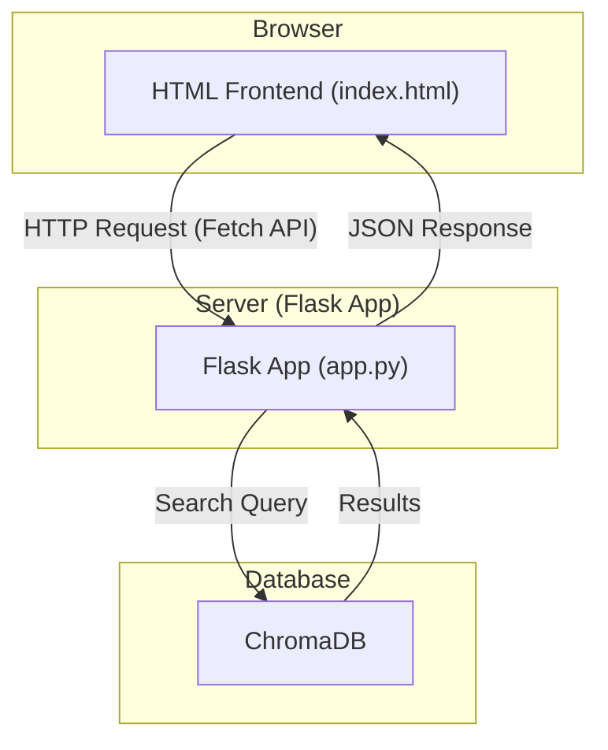

# Stack Overflow Semantic Search Engine

This project is a web-based semantic search engine for a dataset of Stack Overflow questions. Unlike traditional keyword-based search, this application understands the *meaning* of a search query and returns questions that are semantically similar, even if they don't share the exact same words.

The application is built with a Python backend using **Flask** and a vector database (**ChromaDB**), and it features a simple, interactive frontend.

## Features

-   **Semantic Search**: Leverages sentence-transformer models to understand the intent behind a search query.
-   **Interactive Web UI**: A clean and simple web interface for searching and viewing results without page reloads.
-   **Vector Database**: Uses ChromaDB to efficiently store and retrieve tens of thousands of vector embeddings.
-   **View Question Body**: Users can click a "View Body" button to see the full content of a question in a pop-up modal.

## How It Works

The application follows a modern retrieval architecture:

1.  **Indexing**: A Python script (`create_vector_db.py`) processes the `stackoverflow-data-idf.jsonl` file. For each question, it generates a vector embedding from its title using a pre-trained sentence-transformer model and stores this embedding, along with the question's body, in a ChromaDB collection.
2.  **Serving**: A Flask web server (`app.py`) provides the backend. It pre-loads the sentence-transformer model and connects to the ChromaDB instance for fast responses.
3.  **Frontend**: A single HTML file (`templates/index.html`) serves as the user interface. It contains JavaScript that sends the user's query to the Flask backend via a `fetch` request.
4.  **Searching**: When the backend receives a query, it converts it into a vector embedding and uses it to find the most similar vectors in the ChromaDB collection. The corresponding question titles and bodies are returned to the frontend as JSON.
5.  **Displaying**: The frontend JavaScript dynamically renders the search results on the page.

Here is a diagram of the application's architecture:



## Setup and Installation

Follow these steps to run the application locally.

### 1. Install Dependencies

First, install the necessary Python packages from the `requirements.txt` file.

```bash
pip install -r requirements.txt
```

### 2. Build the Vector Database

Next, run the script to process the data and build the ChromaDB vector database. This script will read the `stackoverflow-data-idf.json` file, generate embeddings for each question, and store them in a local directory named `chroma_db`.

This may take a few minutes to complete.

```bash
python create_vector_db.py
```

### 3. Run the Web Application

With the database built, you can now start the Flask web server.

```bash
python app.py
```

### 4. Access the Application

Once the server is running, you will see a message in your terminal indicating the application is running on `http://127.0.0.1:5000`. Open this URL in your web browser to use the search engine.

## Project Iterations: Our Development Process

This project was built iteratively. Here is a summary of the steps we took:

### Iteration 1: Initial Data Exploration

-   **Goal**: Understand the provided `stackoverflow-data-idf.json` file.
-   **Process**: We started by inspecting the file and quickly determined it was a large JSONL file (each line is a separate JSON object). We analyzed the schema to identify key fields like `id`, `title`, and `body`. This initial analysis informed our decision to use a vector database, as loading and searching a 41MB text file directly would be inefficient.

### Iteration 2: Building a Command-Line Vector Search Tool

-   **Goal**: Create a proof-of-concept search tool to validate the vector search approach.
-   **Process**:
    1.  We chose `ChromaDB` for the vector database and `sentence-transformers` for creating the embeddings.
    2.  We created `create_vector_db.py` to populate the database with the question titles.
    3.  We wrote `search.py`, a simple command-line script that allowed us to perform semantic searches and see the results directly in the terminal.

### Iteration 3: Developing a Web-Based User Interface

-   **Goal**: Transform the command-line tool into an interactive web application.
-   **Process**:
    1.  We added `Flask` to the project to serve as the web framework.
    2.  We created `app.py`, which contains the Flask application, and moved the search logic into a `/search` API endpoint.
    3.  We built an HTML frontend (`templates/index.html`) with a search bar. We used JavaScript's Fetch API to send queries to the backend and display the results dynamically, providing a much better user experience.

### Iteration 4: Adding the "View Body" Feature

-   **Goal**: Enhance the application by allowing users to see the full content of a search result.
-   **Process**:
    1.  We updated `create_vector_db.py` to store the question `body` as metadata alongside the vector embeddings.
    2.  We modified the `/search` endpoint in `app.py` to retrieve this body metadata along with the search results.
    3.  We updated `templates/index.html` to include a "View Body" button for each result. Clicking this button now opens a JavaScript-powered modal pop-up to display the full question content without leaving the search page.

## Future Improvements

-   **Clickable Links**: Turn the question IDs into clickable links that point to the original Stack Overflow question (`https://stackoverflow.com/q/QUESTION_ID`).
-   **Display More Metadata**: Show other useful information from the dataset, such as `creation_date`, `answer_count`, and `tags`.
-   **Pagination**: For queries that return many results, implement pagination to improve usability.
-   **Deployment**: Deploy the application to a cloud service like Heroku, Vercel, or AWS so it can be accessed publicly.
-   **Fine-Tuning**: For even better search relevance, the `sentence-transformer` model could be fine-tuned on a question-answering dataset. 